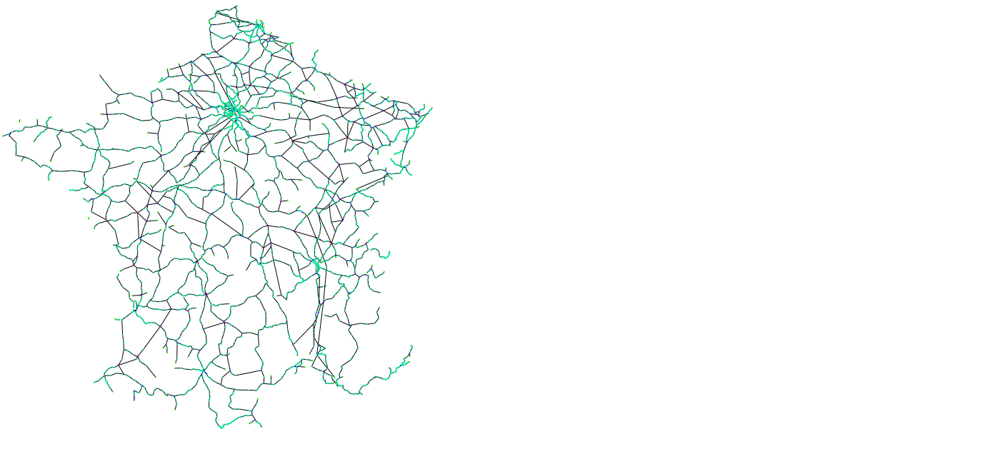

# SNCF-graphs

Graph theory project on SNCF, the french railway company.
The following graphs represent the theoretical importance of each station and railway segment.

The scale used is the following:

## Disconnected graph

   
   

## Connected graph

   
   

## Authors
[Antoine Hazebrouck](https://github.com/Ahaz1701)   
[Arnaud Lambert](https://github.com/arnaud-lambert/)   
[Laure Audouy](https://github.com/laure-a)    
